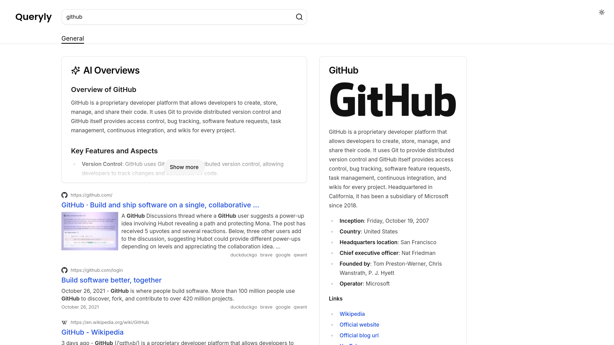

# Queryly

Search engine with AI-powered search results. Built with Astro, React, Vercel AI SDK, and SearXNG.



## Features

- AI-powered search results with Llama 3.1 8b LLM (provided by Groq API)
- Search results from multiple search engines (provided by self-hosted SearXNG)
- Search results and LLM responses caching with Redis
- Rate limiting for LLM responses
- Docker Compose setup for easy deployment

## Todo

- [/] Pagination for search results
- [ ] Categories for search results
- [ ] User settings
- [ ] Responsive UI
- [/] Search suggestions

## Getting started

Quickest way to get started is clone this repository, then make a copy of the .env.example file and rename it to .env. Fill in the required fields.

> [!NOTE]
> `SEARXNG_API` and `REDIS_URL` fields are optional, if you are using the provided Docker Compose setup, you can leave them empty.

After that, use Docker Compose to get the app up and running:

```bash
docker compose up -d --build
```

Open [http://localhost:4321](http://localhost:4321) with your browser to see the result.

## Development

First, get all required services up and running:

```bash
bun docker:up
```

Then, run the development server:

```bash
bun dev
```

## License

This project is licensed under the MIT license. See the [LICENSE](LICENSE) file for more information.
